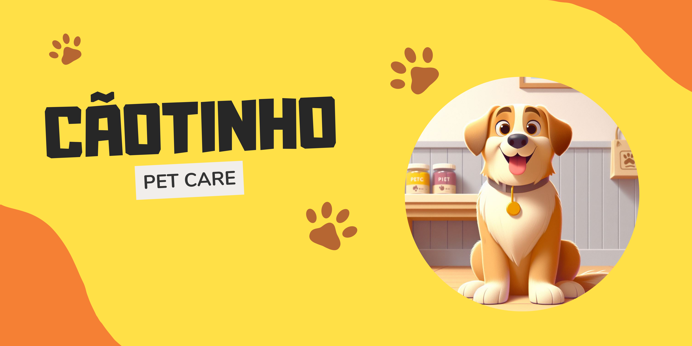

  <h1 style="font-weight: bold;">Cãotinho Pet Care</h1>
  

## Sobre o projeto
Cãotinho é uma aplicação FullStack desenvolvida para facilitar o agendamento de serviços de Pet Care!

  

## Tecnologias

  <h3>Linguagem:</h3>
     

  <h3>Frameworks e Bibliotecas:</h3>
    
    
    
    

  <h3>Ambiente de execução:</h3>
    

  <h3>Banco de Dados e ORM:</h3>
    
    

## Layout

  <h3>Mobile:</h3>
  <h3>Web:</h3>

